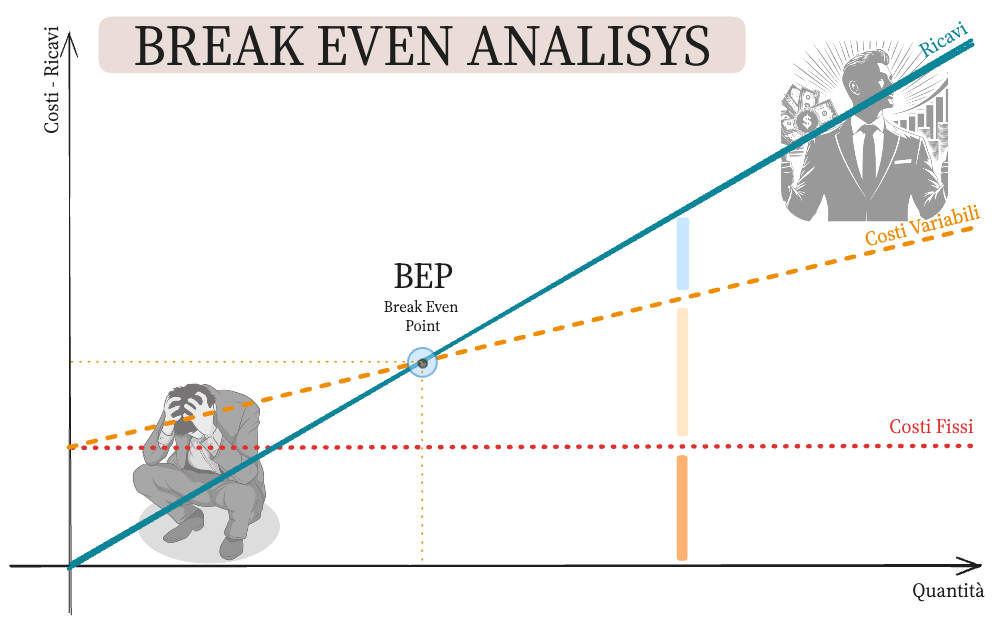

# Analisi del Punto di Pareggio (Break Even Analysis)

---

## BEA: Una Introduzione

### Cos'è la BEA?

> L'Analisi del Punto di Pareggio (Break Even Analysis, BEA) è una tecnica utilizzata per determinare il livello di vendite necessario per coprire i costi totali, senza generare né profitti né perdite.

### Obiettivo della BEA

Identificare il punto in cui le entrate totali e i costi totali si equivalgono.

---

## A cosa serve la BEA

### Utilità della BEA

- **Pianificazione Finanziaria:** Aiuta le aziende a comprendere quanti prodotti devono vendere per coprire i costi.
- **Decisioni di Prezzo:** Assiste nel determinare il prezzo di vendita per garantire che i costi siano coperti.
- **Valutazione dei Rischi:** Analizza l'impatto delle variazioni nei costi e nei prezzi sulle operazioni aziendali.
- **Supporto per la Strategia di Marketing:** Determina i volumi di vendita necessari per raggiungere gli obiettivi di profitto.

---

## Componenti della BEA

### Componenti della BEA

- **Costi Fissi $(C_F)$:** Costi che non variano con il livello di produzione (e.g., affitti, stipendi).
- **Costi Variabili $(C_V)$:** Costi che variano direttamente con il livello di produzione (e.g., materie prime, manodopera).
- **Prezzo di Vendita $(P)$:** Prezzo al quale il prodotto viene venduto.
- **Volume di Vendita $(Q)$:** Numero di unità vendute.

---

## Grafico della BEA

### Descrizione del Grafico

Il grafico del punto di pareggio mostra l'intersezione tra la retta delle entrate totali e la retta dei costi totali.

### Elementi del Grafico

- **Asse delle $x$:** Volume di Vendita $(Q)$
- **Asse delle $y$:** Valore Monetario (€)
- **Retta delle Entrate Totali $(R_T)$:** $$R_{T} = P \times Q$$
- **Retta dei Costi Totali (CT):** $$C_T = C_F + C_V \times Q$$
- **Punto di Pareggio $(Q^*)$:** Punto di intersezione tra $R_T$ e $C_T$

---

## Punto di vista matematico

### Analisi Matematica della BEA

- **Equazioni:**
  - Entrate Totali (RT): $$R_T = P \times Q$$
  - Costi Totali (CT): $$C_T = C_F + C_V \times Q$$
- **Punto di Pareggio:**
  Determinato quando $R_T = C_T$:
  $$
  P \times Q = C_F + C_V \times Q
  $$
  $$
  Q^* = \dfrac{C_F}{P - C_V}
  $$
- **Intersezione delle Rette:**
  Il punto di pareggio è l'intersezione tra la retta delle entrate totali e quella dei costi totali.

---

## Conclusioni

### Sintesi

La BEA è uno strumento cruciale per la pianificazione aziendale e la gestione dei costi.

### Importanza della BEA

Aiuta a prendere decisioni informate su produzione, prezzi e strategie di mercato.

### Applicazione Pratica

Fondamentale per startup e aziende esistenti per valutare la redditività e i rischi.

