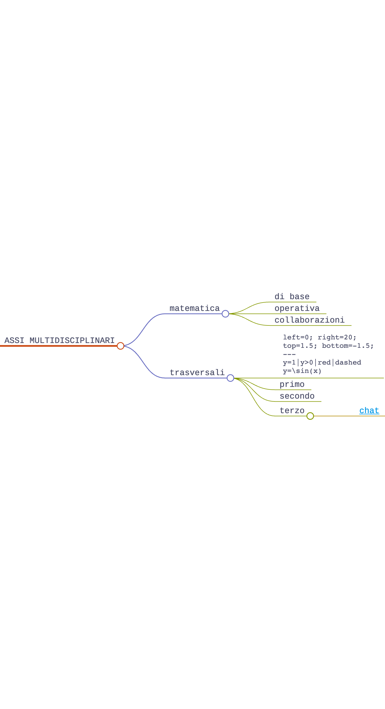
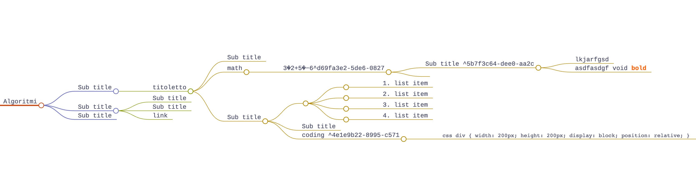

<!-- markdownlint-disable MD033 -->
<!-- markdownlint-disable MD013 -->
<head>
  <title>Lezione simulata</title>
  <link rel="stylesheet" href="style.css">
  <!-- <link rel="stylesheet" href="carte.css"> -->
  <!-- <link rel="stylesheet" href="circular-cards.css"> -->
  <meta name="viewport" content="width=device-width, initial-scale=1">
</head>  </style>

<section data-transition="convex"data-background-image="book_bkg.jpg" data-background-opacity="0.5" data-transition="convex">
  <h2 style="color:#392613">PROGETTAZIONE ATTIVITÀ DIDATTICA</h2>
  <!-- <h2 style="color:#1d91de">ESEMPIO</h2> -->
  
    <!-- <h3 style="color:#8A4117" class="r-fit-text">Relazioni e funzioni</h3> -->
   
  <h4 style="color##342A2A">Diego Fantinelli - matematica A026</h4>
  <h4>Concorso Straordinario Ter - DM 25.05.2021 n. 73</h4>
  <!-- 
<em><a style="color:#1d91de" href="https://2024-mathofthings.netlify.app/">The Math of Things</a> | <a style="color:#1d91de" href="https://2024-mathofthings.netlify.app/slides/capitolo5/">esempio attività didattica</a></em>
 -->
</section>

<section data-transition="convex"data-background-image="book_bkg.jpg" data-background-opacity="0.5">
  <h2 style="color:#392613; text-align:left;"><i class='fas fa-feather'></i>
    La traccia:</h2>
  <h5 class="r-fit-text" style="color:#392613; text-align: justify;">Sunt id in veniam aliqua amet veniam aliquip ut dolore nisi irure irure duis mollit. Ex sunt irure dolor amet culpa elit proident duis id. Nostrud dolore ipsum amet. Aliqua et ut anim amet enim eu laboris ipsum voluptate Lorem aliqua duis ullamco dolore aliqua aliquip commodo irure cupidatat culpa elit proident duis id. Nostrud dolore ipsum amet. Aliqua et ut anim amet enim eu laboris ipsum voluptate Lorem aliqua duis ullamco dolore aliqua. Aliqua et ut anim amet enim eu laboris ipsum voluptate Lorem aliqua duis ullamco dolore aliqua. Aliqua et ut anim amet enim eu laboris ipsum voluptate Lorem aliqua duis ullamco dolore aliqua.</h5>
  
    <!-- <h3 style="color:#8A4117" class="r-fit-text">Relazioni e funzioni</h3> -->
</section>

<section data-background-image="book_bkg.jpg" data-background-opacity="0.5" data-transition="convex">
  <!-- <h1 style="color:#8A4117">Milestones</h1> -->
  <h3 class="r-fit-text" style="color:#3B2F2F"><i class='fas fa-project-diagram'></i> ATTIVITÀ DIDATTICA</h3>

  <table class="fragment" style="font-size:80%" width="90%">
    <!-- <tr>
<td style="color:#8A4117" width="40.0%"><b>competenze</b></td>
<td width="60.0%"><b>descrizione</b></td>
</tr> -->
    <tr>
      <td style="color:#8A4117" width="30.0%"><b>CONTESTO</b></em></td>
      <td width="70.0%">contesto curricolare di riferimento</td>
    </tr>
    <tr>
      <td style="color:#8A4117" width="30.0%"><b>FRAGILITÀ</b></em></td>
      <td width="70.0%">tipologia e frequenza delle disabilità</td>
    </tr>
    <tr>
      <td style="color:#8A4117" width="30.0%"><b>PERCORSO DIDATTICO</b></em></td>
      <td width="70.0%">a. competenze di cittadinanza b. linee guida e indicazioni nazionali</td>
    </tr>
    <tr>
      <td style="color:#8A4117" width="30.0%"><b>VERIFICA COMPETENZE</b></em></td>
      <td width="70.0%">valutazione e autovalutazione delle competenze</td>
    </tr>
    <tr>
      <td style="color:#8A4117" width="30.0%"><b>EFFICACIA DIDATTICA</b></em></td>
      <td width="70.0%">strumenti, metodologie e tecnologie didattiche (TIC)</td>
    </tr>
  </table>
</section>

---

<section data-background-image="book_bkg.jpg" data-background-opacity="0.5" data-transition="convex">
  <h2 class="r-fit-text" style="color:#3B2F2F"><i class='fas fa-chalkboard-teacher'></i> CONTESTO DIDATTICO</h2>
   
  <table class="fragment" style="font-size:90%; color:#342A2A" width="100%" data-transition="convex">
    <tr>
      <td><b>scuola indirizzo</b></td>
      <td>Istituto Tecnico Industriale Meccatronica</td>
    </tr>
    <tr>
      <td><b>contesto territoriale</b></td>
      <td style="font-size:75%">L'itituto è inserito in un territorio
        fortemente orientato all'agricoltura e alla piccola
        industria/artigianato<b></td>
    </tr>
    <tr>
      <td><b>classe</b></td>
      <td style="font-size:80%"><i>es. seconda - fine primo quadrimestre</i></td>
    </tr>
    <tr>
      <td><b>composizione</b></td>
      <td style="font-size:80%"><i>n. studenti: $\%$ maschi e $\%$ femmine</i></td>
    </tr>
    <tr>
      <td><b>fragilità</b></td>
      <td style="font-size:80%"><i>$\%$ e tipologiam</i></td>
    </tr>
  </table>
</section>

---

<section data-background-image="fragile.jpg" data-background-opacity="0.4" data-transition="convex">
  <h2 style="color:#8A4117">Le FRAGILITÀ</h2>
  <h4 class="fragment" style="color:#b82460;">La Classe come COMUNITÀ</h4>
  <table class="fragment" style="color:#342A2A; font-size:90%" width="100%">
    <tr>
      <td><b>tipologia documentazione</b></td>
      <td style="font-size:80%"><i></b><em>analisi delle certificazioni:  BES, L.104/1992, sostegno, GLO, DSA L.170/2010, D.M. 27/12/2012 e C.M. 08/2013</em><i></td>
    </tr>
    <tr>
      <td><b>collaborazione</b></td>
      <td style="font-size:80%"><i><em>percorso di supporto con studente, CdC, GLO, famiglia ed eventuale sostegno</em> <i></td>
    </tr>
    <tr>
      <td><b>strumenti di lavoro</b></td>
      <td style="font-size:80%"><i>strumenti compensativi e dispensativi: PEI e PDP<i></td>
    </tr>
  </table>
</section>

<section data-background-image="fragile.jpg" data-background-opacity="0.4" data-transition="convex">
  <h2 style="color:#8A4117">Le FRAGILITÀ</h2>
  <h4 class="fragment" style="color:#b82460;">La Classe come COMUNITÀ</h4>
  <table class="fragment" style="color:#342A2A; font-size:90%" width="100%">
    <tr>
      <td><b>tipologia documentazione</b></td>
      <td style="font-size:80%"><i></b><em>analisi delle certificazioni:  BES, L.104/1992, sostegno, GLO, DSA L.170/2010, D.M. 27/12/2012 e C.M. 08/2013</em><i></td>
    </tr>
    <tr>
      <td><b>collaborazione</b></td>
      <td style="font-size:80%"><i><em>percorso di supporto con studente, CdC, GLO, famiglia ed eventuale sostegno</em> <i></td>
    </tr>
    <tr>
      <td><b>strumenti di lavoro</b></td>
      <td style="font-size:80%"><i>strumenti compensativi e dispensativi: PEI e PDP<i></td>
    </tr>
  </table>
</section>

---

<section data-background-image="book_bkg.jpg" data-background-opacity="0.5" data-transition="convex">
  <h1 class="r-fit-text">COMPETENZE DI CITTADINANZA</h1>
  <h4 style="color:#3B2F2F; font-size: 70%;"> Raccomandazione del Parlamento Europeo e del Consiglio del 18/12/2006 </h4>
  <h4 style="color:#3B2F2F; font-size:70%;"> D.M. n. 139 del 22 agosto 2007 </h4>
  <table class="fragment" style="font-size:60%" width="90%">
    <tr>
      <td width="40.0%"><b>competenze</b></td>
      <td width="60.0%"><b>descrizione</b></td>
    </tr>
    <tr>
      <td width="40.0%"><em>1. imparare ad imparare</em></td>
      <td width="60.0%">organizzare il proprio apprendimento</td>
    </tr>
    <tr>
      <td width="40.0%"><em>2. saper progettare</em></td>
      <td width="60.0%">elaborare e realizzare progetti</td>  
    </tr>
    <tr>
      <td width="40.0%"><em>3. saper comunicare</em></td>
      <td width="60.0%">presentare in modo efficace</td>
    </tr>
    <tr>
      <td width="40.0%"><em>4. collaborare e partecipare</em></td>
      <td width="60.0%">a. saper interagire in un gruppo b. l'importanza della sinergia</td>
    </tr>
    <tr>
      <td width="40.0%"><em>6. problem solving</em></td>
      <td width="60.0%">a. sapersi documentare b. formulare ipotesi c. analizzare i dati d. proporre soluzioni</td>
    </tr>
    <tr>
      <td width="40.0%"><em>7. imparare a collegare</em></td>
      <td width="60.0%">a. mappe concettuali  b. formulare percorsi</td>
    </tr>
    <tr>
      <td width="40.0%"><em>8. verificare l'informazione</em></td>
      <td width="60.0%">formare e coltivare uno spirito critico</td>
    </tr>
  </table>
</section>

<section data-background-image="book_bkg.jpg" data-background-opacity="0.5" data-transition="convex">
  <h1 class="r-fit-text">COMPETENZE DI CITTADINANZA</h1>
  <h4 style="color:#3B2F2F"> specifiche disciplinari </h4>
  <!-- <h4 style="color:#3B2F2F"> D.M. n. 139 del 22 agosto 2007 </h2> -->
  <table style="font-size:65%; color:#0891B2" width="95%">
    <tr>
      <td width="40.0%"><b>competenze</b></td>
      <td width="60.0%"><b>descrizione</b></td>
    </tr>
    <tr>
      <td width="40.0%"><em>1. imparare ad imparare</em></td>
      <td width="60.0%">organizzare il proprio apprendimento</td>
    </tr>
    <tr>
      <td width="40.0%"><em>2. saper progettare</em></td>
      <td width="60.0%">elaborare e realizzare progetti</td>  
    </tr>
    <tr>
      <td width="40.0%"><em>4. collaborare e partecipare</em></td>
      <td width="60.0%">a. saper interagire in un gruppo b. l'importanza della sinergia</td>
    </tr>
    <tr>
      <td width="40.0%"><em>6. problem solving</em></td>
      <td width="60.0%">a. sapersi documentare b. formulare ipotesi c. analizzare i dati d. proporre soluzioni</td>
    </tr>
  </table>
</section>

<section data-background-image="book_bkg.jpg" data-background-opacity="0.5" data-transition="convex">
  <h2 style="color:#8A4117" class="r-fit-text">LINEE GUIDA e INDICAZIONI NAZIONALI 2010</h2>
  <h5><b>Competenze di base - Istituti Tecnici</b></h5><em>
    <h5 style="color:#8A4117">secondo biennio e quinto anno</h5>
    <ul style="font-size:70%">
      <li>Utilizzare il linguaggio e i metodi propri della matematica per organizzare e valutare adeguatamente informazioni qualitative e quantitative</li>
      <li>Utilizzare le strategie del pensiero razionale negli aspetti dialettici e algoritmici per affrontare situazioni problematiche, elaborando opportune soluzioni</li>
      <li>Utilizzare le reti e gli strumenti informatici nelle attività di studio, ricerca e approfondimento disciplinare</li>
      <li>Correlare la conoscenza storica generale agli sviluppi delle scienze, delle tecnologie e delle tecniche negli specifici campi professionali di riferimento</li>
    </ul></em>
</section>

---

<section data-auto-animate data-background-image="book_bkg.jpg" data-background-opacity="0.4" data-transition="convex">
  <h3 style="color:#3B2F2F"><i class="fa fa-users"></i></i> PROGRAMMAZIONE D'ISTITUTO</h3>
  <table style="font-size:65%; width="95%">
    <tr>
      <td width="40.0%"><h3>competenze</h3></td>
      <td width="60.0%"><h3>descrizione</h3></td>
    </tr>
    <tr>
      <td width="40.0%"><em>1. imparare ad imparare</em></td>
      <td width="60.0%">organizzare il proprio apprendimento</td>
    </tr>
    <tr>
      <td width="40.0%"><em>2. saper progettare</em></td>
      <td width="60.0%">elaborare e realizzare progetti</td>  
    </tr>
    <tr>
      <td width="40.0%"><em>4. collaborare e partecipare</em></td>
      <td width="60.0%">a. saper interagire in un gruppo b. l'importanza della sinergia</td>
    </tr>
    <tr>
      <td width="40.0%"><em>6. problem solving</em></td>
      <td width="60.0%">a. sapersi documentare b. formulare ipotesi c. analizzare i dati d. proporre soluzioni</td>
    </tr>
  </table>
</section>

<section data-auto-animate data-background-image="book_bkg.jpg" data-background-opacity="0.4" data-transition="convex">
  <h3 style="color:#3B2F2F">PROGRAMMAZIONE D'ISTITUTO</h3>
  <table style="font-size:65%; width="95%">
    <tr>
      <td width="40.0%"><b>competenze</b></td>
      <td width="60.0%"><b>descrizione</b></td>
    </tr>
    <tr>
      <td width="40.0%"><em>1. imparare ad imparare</em></td>
      <td width="60.0%">organizzare il proprio apprendimento</td>
    </tr>
    <tr>
      <td width="40.0%"><em>6. problem solving</em></td>
      <td width="60.0%">a. sapersi documentare b. formulare ipotesi c. analizzare i dati d. proporre soluzioni</td>
    </tr>
  </table>
</section>

---

<section data-auto-animate data-background-image="book_bkg.jpg" data-background-opacity="0.4" data-transition="convex">
  <h3 style="color:#3B2F2F">PROGRAMMAZIONE D'ISTITUTO</h3>
  

    

      <h4 style="color:#3B2F2F">conoscenze</h4>
      <ul style="font-size:60%">
        <li>individuare collegamenti tra matematica e altre discipline e tra matematica e realtà <em>(modello matematico)</em></li>
        <li>individuare collegamenti all’interno della matematica</li>
        <li>sviluppare l’algebra interpretandola graficamente</li>
        <li>utilizzare strumenti informatici di rappresentazione geometrica e di calcolo</li>
         
      </ul>
    

    

      <h4 style="color:#3B2F2F">abilità</h4>
      <ul style="font-size:60%">
        <li>Utilizzare il linguaggio e i metodi propri della matematica per organizzare e valutare adeguatamente informazioni qualitative e quantitative</li>
        <li>Utilizzare le reti e gli strumenti informatici nelle attività di studio, ricerca e approfondimento disciplinare</li>
        <li>Correlare la conoscenza storica generale agli sviluppi delle scienze, delle tecnologie e delle tecniche negli specifici campi professionali di riferimento</li>
      </ul>
    

  

</section>

<section data-auto-animate data-background-image="book_bkg.jpg" data-background-opacity="0.4" data-transition="convex">
  <h3 style="color:#3B2F2F">PROGRAMMAZIONE D'ISTITUTO</h3>
  

    

      <h4 style="color:#3B2F2F">competenze</h4>
      <ul style="font-size:65%">
        <li>Utilizzare il linguaggio e i metodi propri della matematica per organizzare e valutare adeguatamente informazioni qualitative e quantitative</li>
        <li>Utilizzare le reti e gli strumenti informatici nelle attività di studio, ricerca e approfondimento disciplinare</li>
        <li>Correlare la conoscenza storica generale agli sviluppi delle scienze, delle tecnologie e delle tecniche negli specifici campi professionali di riferimento</li>
      </ul>
    

  

</section>

---

<section data-background-image="net_bkg.jpg" data-background-opacity="0.4" data-transition="concave">
  <h2 class="r-fit-text" style="color:#8A4117"><i class='fa fa-users'></i> U.d.A. di riferimento</h2>
  <!--  -->
  
sistema di gestione delle informazioni basato sull'efficacia di <em>tags</em> e <em>backlinks</em> per i collegamenti tra le note; utilizza la semplicità del Markdown ma, tramite infiniti plugin, supporta Html, Css, $\LaTeX$ simulando una gestione della conoscenza sul modello delle reti neuronali

</section>

<section data-auto-animate data-background-image="book_bkg.jpg" data-background-opacity="0.4" data-transition="convex">
  <h2>Programmazione </h2>

  

    

      <h4 class="fragment">conoscenze</h4>
      <ul class="fragment" style="font-size:60%">
        <li>Utilizzare il linguaggio e i metodi propri della matematica per organizzare e valutare adeguatamente informazioni qualitative e quantitative</li>
        <li>Utilizzare le reti e gli strumenti informatici nelle attività di studio, ricerca e approfondimento disciplinare</li>
      </ul>
    

    

      <h4 class="fragment">abilità</h4>
      <ul class="fragment" style="font-size:60%">
        <li>Utilizzare le reti e gli strumenti $y=f(x)=2x^2-5x+2$ di studio, ricerca e approfondimento disciplinare</li>
        <li>Correlare la conoscenza storica generale agli sviluppi delle scienze, delle tecnologie e delle tecniche negli specifici campi professionali di riferimento</li>
      </ul>
    

  

</section>

<section data-auto-animate data-background-image="book_bkg.jpg" data-background-opacity="0.4" data-transition="convex">
  <h2>Programmazione</h2>

  

    

      <h3>competenze</h3>
      <ul style="font-size:60%">
        <li>Utilizzare il linguaggio e i metodi propri della matematica per organizzare e valutare adeguatamente informazioni qualitative e quantitative</li>
        <li>Utilizzare le reti e gli strumenti informatici nelle attività di studio, ricerca e approfondimento disciplinare</li>
        <li>Correlare la conoscenza storica generale agli sviluppi delle scienze, delle tecnologie e delle tecniche negli specifici campi professionali di riferimento</li>
      </ul>
    

  

</section>

<section data-background-image="book_bkg.jpg" data-background-opacity="0.4" data-transition="convex">
  <h2>Programmazione</h2>

  

    

      <h3>competenze</h3>
      <ul style="font-size:60%">
        <li>Utilizzare il linguaggio e i metodi propri della matematica per organizzare e valutare adeguatamente informazioni qualitative e quantitative</li>
        <li>Utilizzare il linguaggio e i metodi propri della matematica per organizzare e valutare adeguatamente informazioni qualitative e quantitative</li>
        <li>Utilizzare il linguaggio e i metodi propri della matematica per organizzare e valutare adeguatamente informazioni qualitative e quantitative</li>
        <li>Utilizzare il linguaggio e i metodi propri della matematica per organizzare e valutare adeguatamente informazioni qualitative e quantitative</li>
        <li>Utilizzare le reti e gli strumenti informatici nelle attività di studio, ricerca e approfondimento disciplinare</li>
        <li>Correlare la conoscenza storica generale agli sviluppi delle scienze, delle tecnologie e delle tecniche negli specifici campi professionali di riferimento</li>
      </ul>
    

  

</section>

---

<section data-background-image="calm_bkg.jpg" data-background-opacity="0.4" data-transition="convex">
  <h1 style="color:#3B2F2F" class="r-fit-text">La VALUTAZIONE</h1>
  <h3 style="color:#3B2F2F" class="fragment">Tipologie di VERIFICA</h3>

  <ol style="font-size:70%" class="fragment" data-transition="concave">
    <li><h4 style="color:#b82460"><b>verifica dei prerequisiti</b></h4></li>
    <ul>
      <li>Test anonimo e di autovalutazione <a href="./20220224_TEST-1I-Relazioni e funzioni.pdf" target="_blank"> <em>- esempio </em><i style="color:#eb432aff" class="fas fa-file-pdf fa-xs"></i></a></li>
      <li>all'inizio dell'UdA </li>
    </ul>
    <li><h4 style="color:#b82460"><b>valutazione formativa</b> - <em>in funzione dell'apprendimento</em></h4></li>
    <ul>
      <li>Peer-Tutoring | Flipped Classroom o Jigsaw <a href="./Divisione e Ruffini-Flipped Classroom-contest_prize.pdf" target="_blank"> <em>- esempio </em><i style="color:#eb432aff" class="fas fa-file-pdf fa-xs"></i></a></li>
      <li>in itinere e - ove possibile - di tipo laboratoriale</li>
    </ul>
    <li><h4 style="color:#b82460"><b>valutazione sommativa</b></h4></li>
    <ul>
      <li>verifica classica: <em>Test + Esercizi</em> <a href="./202122-ESEMPIO_VERIFICA_classica-soluzioni.pdf" target="_blank"> <em>- esempio </em><i style="color:#eb432aff" class="fas fa-file-pdf fa-xs"></i></a></li>
      <li>alla fine dell'UdA </li>
    </ul>
    <li><h4 style="color:#b82460"><b>interrogazione</b></h4> per eventuale recupero o miglioramento</li>
  </ol>
</section>

<section data-background-image="calm_bkg.jpg" data-background-opacity="0.4" data-transition="convex">
  

    <h3>Card Title 1</h3>
    
Lorem ipsum dolor sit amet, consectetur adipiscing elit. Nullam sed lectus euismod, fermentum eros ut, pharetra mi. In hac habitasse platea dictumst.

    <a href="./20220224_TEST-1I-Relazioni e funzioni.pdf" class="card-link"><i style="color:#eb432aff" class="fas fa-file-pdf fa-xs"></i></a>
  

  

    <h3>Card Title 2</h3>
    
Donec ac augue vitae augue mollis semper. Sed ac augue eget neque placerat luctus. Proin sed nunc velit, eget vestibulum ante dictum vitae.

    <a href="https://unsplash.com/s/photos/dark" class="card-link">Explore Now</a>
  

</section>

<section r-fit-text data-background-image="book_bkg.jpg" data-background-opacity="0.4" data-transition="convex">
  <h2 style="color:#3B2F2F" class="r-fit-text">La VALUTAZIONE</h2>
  

    

      <a href="./20220224_TEST-1I-Relazioni e funzioni.pdf" target="_blank">
        <h4 style="color:#b82460"><b>FORMATIVA</b></h4>
        
Donec ac augue vitae augue mollis semper. Sed ac augue eget neque placerat luctus. Proin sed nunc velit, eget vestibulum ante dictum vitae.

        <a class="card-link" href="./20220224_TEST-1I-Relazioni e funzioni.pdf" >link</a>
      </a>
    

    

      <a href="./20220224_TEST-1I-Relazioni e funzioni.pdf">
        <h4 style="color:#b82460"><b>FORMATIVA</b></h4>
        <ul style="font-size:70%">
          <li>Test anonimo e di autovalutazione <i style="color:#eb432aff" class="fas fa-file-pdf fa-xs"></i></li>
          <li>all'inizio dell'UdA </li>
        </ul>
      </a>
    

    

      <a href="./20220224_TEST-1I-Relazioni e funzioni.pdf" target="_blank">
        <h4 style="color:#b82460"><b>SOMMATIVA</b></h4>
        <ul style="font-size:70%">
          <li>Test anonimo e di autovalutazione <i style="color:#eb432aff" class="fas fa-file-pdf fa-xs"></i></li>
          <li>all'inizio dell'UdA </li>
        </ul>
      </a>
    

  

</section>

---

<section data-background-image="pingpong_bkg.jpg" data-background-opacity="0.4" data-transition="convex">
  <h1 style="color:#8A4117" class="r-fit-text">STRUMENTI DIDATTICI</h1>
  <h3 style="color:#3B2F2F" class="fragment">TIC avanzate</h3>

  <table class="fragment" style="font-size:55%" width="95%">
    <tr>
      <td width="20.0%"><em><b><a style="color:#1d91de" href="https://obsidian.md/">Obsidian.md</a></b></em></td>
      <td width="80.0%">sistema di gestione delle informazioni basato sull'efficacia di <em>tags</em> e <em>backlinks</em> per i collegamenti tra le note; utilizza la semplicità del Markdown ma, tramite infiniti plugin, supporta Html, Css, $\LaTeX$ simulando una gestione della conoscenza sul modello delle reti neuronali - <em>Second Brain</em></td>
    </tr>
    <tr>
      <td width="20.0%"><em><b><a style="color:#1d91de" href="https://revealjs.com/">NeoVim</a></b></em>
      </td>
      <td width="80.0%">Strumento per la preparazione di presentazioni professionali efficiente e flessibile che supporta Html, Css, Markdown e $\LaTeX$</td>
    </tr>
    <tr>
      <td width="20.0%"><em><b><a style="color:#1d91de" href="https://revealjs.com/">Reveal.js</a></b></em></td>
      <td width="80.0%">Strumento per la preparazione di presentazioni professionali efficiente e flessibile che supporta Html, Css, Markdown e $\LaTeX$</td>
    </tr>
    <tr>
      <td width="20.0%"><em><b>$\LaTeX$</b></em></td>
      <td width="80.0%">per conferire un carattere accademico a tutta la documentazione didattica</td>
    </tr>
    <tr>
      <td width="20.0%"><em><b><a style="color:#1d91de" href="https://2024-mathofthings.netlify.app/">The Math of Things</a></b></em></td>
      <td width="80.0%">un sito web statico sviluppato con <a style="color:#1d91de" href="https://obsidian.md/">Hugo.io</a> come "contenitore didattico" - un ausilio semplice ed efficace alla progettazione didattica; supporta: Markdown, Html, Css, $\LaTeX$ e Reveal.js</td>
    </tr>
  </table>
</section>

<!-- iframe -->
<section data-background-iframe="https://2024-mathofthings.netlify.app/"
  data-background-interactive>
  <!-- <h2>Iframe</h2> -->
</section>

---

<section data-background-image="pile.jpg" data-background-opacity="0.3" data-transition="convex">
  <h1 style="color:#8A4117">Le Fasi</h1>
  <h3 style="color:#3B2F2F">ATTIVITÀ DIDATTICA </h3>

  <table class="fragment" style="font-size:80%" width="80%">
    <tr>
      <td style="color:#8A4117" width="20.0%"><em>Fase 1</em></td>
      <td width="50.0%">Questioning</td>
      <td width="10.0%">$5^{\prime}$</td>
    </tr>
    <tr>
      <td style="color:#8A4117" width="20.0%"><em>Fase 2</em></td>
      <td width="50.0%">Framing - <em>mindmapping</em></td>
      <td width="10.0%">$5^{\prime}$</td>
    </tr>
    <tr>
      <td style="color:#8A4117" width="20.0%"><em>Fase 3</em></td>
      <td width="50.0%">Active</td>
      <td width="10.0%">$15^{\prime}$</td>
    </tr>
    <tr>
      <td style="color:#8A4117" width="20.0%"><em>Fase 4</em></td>
      <td width="50.0%">Lab & Cooperative-learning</td>
      <td width="10.0%">$20^{\prime}$</td>
    </tr>
    <tr>
      <td style="color:#8A4117" width="20.0%"><em>Fase 5</em></td>
      <td width="50.0%">Recap</td>
      <td width="10.0%">$10^{\prime}$</td>
    </tr>
    <tr>
      <td style="color:#eb432aff" width="20.0%"><em>Fase 6</em></td>
      <td style="color:#eb432aff" width="50.0%"><em>homework</em></td>
      <td style="color:#eb432aff" width="10.0%"><em>post</em></td>
    </tr>
  </table>
</section>

---

<section data-background-image="pile.jpg" data-background-opacity="0.3" data-transition="convex">
  <h2 class="r-fit-text" style="color:#8A4117"><i class='fas fa-spinner'></i> Questioning &nbsp; ${\small{5'}}$ </h2>
  <!-- <h3 style="color:#3B2F2F" class="fragment">QUESTIONING</h3> -->
  <ul class="fragment">
    <li style="color:#b82460"><em>stimoli di diversa natura con lo scopo di catturare l'attenzione:</em></li>
    <ul style="font-size: 80%"> 
      <li>una frase, un aforisma, un post, una foto, un video, un articolo, una <em>"provocazione"</em></li>
      <li> tutto il materiale è preparato in anticipo e caricato su: <a style="color:#b82460" href="https://2023-mathofthings.netlify.app/"><em>The Math of Things</em></a></li>
    </ul>
  </ul>
</section>

<section data-background-image="pile.jpg" data-background-opacity="0.3" data-transition="convex">
  <q style="color:#b82460; font-size: 40px"><em>In fisica e in matematica è impressionante la sproporzione tra lo sforzo per capire una cosa nuova per la prima volta e la semplicità e naturalezza del risultato una volta che i vari passaggi sono stati compiuti.
     Nel prodotto finito, nelle scienze come in poesia, non c'è traccia della fatica del processo creativo e dei dubbi e delle esitazioni che lo accompagnano.</q>  
  &mdash; Giorgio Parisi  ("In un volo di storni" - ed. Rizzoli - 2021)
  </em>
</section>

---

<section data-background-image="pile.jpg" data-background-opacity="0.4" data-transition="convex">
  <h1 class="r-fit-text" style="color:#8A4117">2. framing &nbsp; ${\small{5'}}$ </h1>
  <!-- <h2 style="color:#3B2F2F" class="fragment"> FRAMING </h2> -->
  <ul class="fragment">
    <li style="color:#b82460; font-size: 80%;"><em>un filo conduttore con forte impatto visivo, efficace e sintetico, che permetta di evidenziare:</em></li> 
    <ul class="fragment" style="font-size: 82%;">
      <li><b><em>prerequisiti</b>: da dove veniamo</em></li>
      <li><b><em>obiettivi</b>: dove dobbiamo andare</em></li>
      <li><b><em>strumenti</b>: con quali mezzi affrontiamo il viaggio</em></li>
    </ul>
  </ul>
</section>

<section data-background-image="pile.jpg" data-background-opacity="0.3" data-transition="convex">
  <h2 style="color:#8A4117">MINDMAPPING</h2>
  
</section>

---

<section data-background-video="teaching.mp4" data-background-opacity="0.3" data-transition="convex">
  <h1 style="color:#8A4117">FASE 3 &nbsp; ${\small{15'}}$ </h2>
    <h2 style="color:#3B2F2F" class="fragment">ACTIVE - trasmissiva</h2>
    <!-- <ul class="fragment" data-transition="concave">
<li><h4>Contenuti - Lezione frontale</h4></li>  -->
    <ul class="fragment" style="font-size: 80%;" >
      <li><b>contenuti: </b>della lezione in formato <a style="color:#1d91de" href="https://2023-mathofthings.netlify.app/slides/capitolo5/" target="_blank"><em>slides</em></a></li>
      <li><b>consultazione: </b>libro di testo in formato digitale</li>
      <li><b>consigli: </b>per la revisione in autonomia degli appunti</li>
      <li><b>strumenti informatici: </b><em>Obsidian, VSCode, Reveal.js, etc.</em></li>
    </ul>
    <!-- </ul> -->
</section>
<section data-background-image="calm_bkg.jpg" data-background-opacity="0.4" data-transition="convex">

<h2 style="color:#8A4117">Contenuti specifici &nbsp; </h2>
<h3 style="color:#3B2F2F" class="fragment">Derivate - introduzione</h2>
  <ul class="fragment" style="font-size: 80%;" >
    <li><b>contenuti: </b>della lezione in formato <a style="color:#1d91de" href="https://2023-mathofthings.netlify.app/slides/capitolo5/" target="_blank"><em>slides</em></a></li>
    <li><b>strumenti informatici: </b><em>Obsidian, NeoVim, Reveal.js, etc.</em></li>
  </ul>

  
</section>

<section data-background-image="calm_bkg.jpg" data-background-opacity="0.4" data-transition="convex">

<h2 style="color:#8A4117">Contenuti specifici &nbsp; </h2>
<h3 style="color:#3B2F2F" class="fragment">Derivate - introduzione</h2>
  <ul class="fragment" style="font-size: 80%;" >
    <li><b>contenuti: </b>della lezione in formato <a style="color:#1d91de" href="https://2023-mathofthings.netlify.app/slides/capitolo5/" target="_blank"><em>slides</em></a></li>
    <li><b>problema della tangente: </b><em>Una secante che ce l'ha fatta!</em></li>
  </ul>

  
</section>

<section data-background-image="pingpong_bkg.jpg" data-background-opacity="0.2">
  <h1 class="r-fit-text">elaborazione delle idee</h1>
  

    

      <h3 class="fragment">Titolo della slide</h3>
      
Testo della slide nella colonna di sinistra.

      <ul class="fragment">
        <li>Lista di punti</li>
        <li>Altro punto</li>
      </ul>
    

    

      
        <!--  -->
    

  

</section>

---

<section data-background-video="teaching.mp4" data-background-opacity="0.3" data-transition="convex">
  <h1 style="color:#8A4117">FASE 4 &nbsp; ${\small{20'}}$ </h1>
  <h3 style="color:#3B2F2F" class="fragment">Math LAB</h3>
  <ul class="fragment" style="font-size: 80%;">
    <li>correzione esercizi assegnati</li>
    <ul style="color:#8A4117">
      <li>a cura dello studente: per acquisire sicurezza</li>
      <li>a cura dell'insegnante</li>
    </ul>
    <li>Cooperative learning: es. peer-tutoring</li>
    <li>strumenti informatici: <em>es. Geogebra, Desmos, Wolfram Alpha, etc.</em></li>
  </ul>
</section>

<section data-background-image="calm_bkg.jpg" data-background-opacity="0.4" data-transition="convex">

<h2 style="color:#8A4117">derivate elementari &nbsp; </h2>
<h3 style="color:#3B2F2F" class="fragment">Derivate - introduzione</h2>
  <ul class="fragment" style="font-size: 80%;" >
    <li><b>contenuti: </b>della lezione in formato <a style="color:#1d91de" href="https://2023-mathofthings.netlify.app/slides/capitolo5/" target="_blank"><em>slides</em></a></li>
    <li><b>strumenti informatici: </b><em>Obsidian, NeoVim, Reveal.js, etc.</em></li>
  </ul>

  
</section>

<section data-background-image="calm_bkg.jpg" data-background-opacity="0.4" data-transition="convex">

<h2 style="color:#8A4117">Derivate: operazioni &nbsp; </h2>
<h3 style="color:#3B2F2F" class="fragment">Derivate - introduzione</h2>
  <ul class="fragment" style="font-size: 80%;" >
    <li><b>contenuti: </b>della lezione in formato <a style="color:#1d91de" href="https://2023-mathofthings.netlify.app/slides/capitolo5/" target="_blank"><em>slides</em></a></li>
    <li><b>strumenti informatici: </b><em>Obsidian, NeoVim, Reveal.js, etc.</em></li>
  </ul>

  
</section>

<section data-background-image="pingpong_bkg.jpg" data-background-opacity="0.4" data-transition="convex">

<h2 style="color:#8A4117">Cooperative Lab </h2>
  <!-- <h3 style="color:#3B2F2F" class="fragment">Derivate - introduzione</h2> -->
  <!--   <ul class="fragment" style="font-size: 80%;" > -->
  <!--     <li><b>contenuti: </b>della lezione in formato <a style="color:#1d91de" href="https://2023-mathofthings.netlify.app/slides/capitolo5/" target="_blank"><em>slides</em></a></li> -->
  <!--     <li><b>strumenti informatici: </b><em>Obsidian, NeoVim, Reveal.js, etc.</em></li> -->
  <!--   </ul> -->

  
</section>

---

<section data-background-image="calm_bkg.jpg" data-background-opacity="0.4" data-transition="convex">
  <h1 style="color:#8A4117">FASE 5 &nbsp; ${\small{10'}}$ </h2>
    <h3 style="color:#3B2F2F" class="fragment">Lesson RECAP</h3>
    <ul class="fragment">
      <!-- <h3 style="color:#8A4117"><em>Focus sulla lezione</em></h3> -->
      <ul>
        <ul style="font-size: 80%;">
          <li>qual è stato l'obiettivo della lezione?</li>
          <li>cos'è rimasto della trattazione?</li>
          <li>consigli per lo studio individuale</li>
        </ul> 
        <li style="color:#b82460; font-size: 32px"><em>in questa fase è indispensabile il coinvolgimento attivo degli studenti</em></li>
      </ul>
</section>

<!-- <section data-auto-animate style="height: 600px" data-background-image="pingpong_bkg.jpg" data-background-opacity="0.4"> -->
<!--   <!-- <h3 style="opacity: 0.3; font-size: 18px;">SLIDE 1</h3> --> -->
<!--   <!-- <h3 data-id="title" style="margin-top: 100px;">Così si ricorda</h3> --> -->
<!--   <h2 data-id="title" style="margin-top:500px;">Animate Anything</h2> -->
<!--   

 -->
<!--   

 -->
<!--   

 -->
<!--   

 -->
<!-- </section> -->
<!-- <section data-auto-animate style="height: 600px" data-background-image="pingpong_bkg.jpg" data-background-opacity="0.4"> -->
<!--   <!-- <h3 style="opacity: 0.3; font-size: 18px;">SLIDE 2</h3> --> -->
<!--   <!-- <h4 data-id="title" style="margin-top: 100px;">basta ripetere lo stesso concetto</h4> --> -->
<!--   <h2 data-id="title" style="margin-top: 500px">With Auto Animate</h2> -->
<!--   

 -->
<!--   

 -->
<!--   

 -->
<!--   

 -->
<!-- </section> -->
<!-- <section data-auto-animate style="height: 600px" data-background-image="pingpong_bkg.jpg" data-background-opacity="0.4"> -->
<!--   <!-- <h3 style="opacity: 0.3; font-size: 18px;">SLIDE 3</h3> --> -->
<!--   <!-- <h4 data-id="title" style="margin-top: 100px;">in modo diverso</h4> --> -->
<!--   <h2 data-id="title" style="margin-top: 500px;">Così si ricorda</h2> -->
<!--   

 -->
<!--   

 -->
<!--   

 -->
<!--   

 -->
<!-- </section> -->
<!-- <section data-auto-animate style="height: 600px" data-background-image="pingpong_bkg.jpg" data-background-opacity="0.4"> -->
<!--   <!-- <h3 style="opacity: 0.3; font-size: 18px;">SLIDE 3</h3> --> -->
<!--   <!-- <h4 data-id="title" style="margin-top: 100px;">...magari al contrario</h4> --> -->
<!--   <h2 data-id="title" style="margin-top: 500px;">più facilmente</h2> -->
<!--   

 -->
<!--   

 -->
<!--   

 -->
<!--   

 -->
<!-- </section> -->

---

<section data-background-image="book_bkg.jpg" data-background-opacity="0.4" data-transition="convex">
  <h1 style="color:#8A4117">FASE 6 &nbsp; <em>post</em></h1>
  <h2 style="color:#3B2F2F" class="fragment">Homeworks</h2>
  <ul class="fragment" style="font-size: 80%;">
    <li><h3 style="color:#8A4117">Lavoro in autonomia</h3></li>
    <ul>
      <li>rielaborazione e integrazione<em> guidata</em> degli appunti</li>
      <li>esercizi assegnati </li>
      <li>attività collaborative - <em>cooperative learning</em></li>
    </ul> 
    <li style="color:#b82460"><em>tutti i materiali vengono condivisi su Google Classroom</em></li>
  </ul>
</section>

---

<section data-background-video="ntwk_bkg.mp4" data-background-opacity="0.8">
  <h2 style="color:#06B6D4" class="r-fit-text">Creare connessioni</h2>
  <section>
    <h3 class="fragment" font-size:55px" data-transition="convex">La matematica non ha come finalità quella di imparare formule e/o dimostrazioni a memoria, bensì di imparare a <b><u>collegare concetti</u></b>, per stimolare la formazione di uno <b><u>spirito critico</u></b></h3>
  </section>

  ---

  <section data-transition="zoom">
    
  </section>
