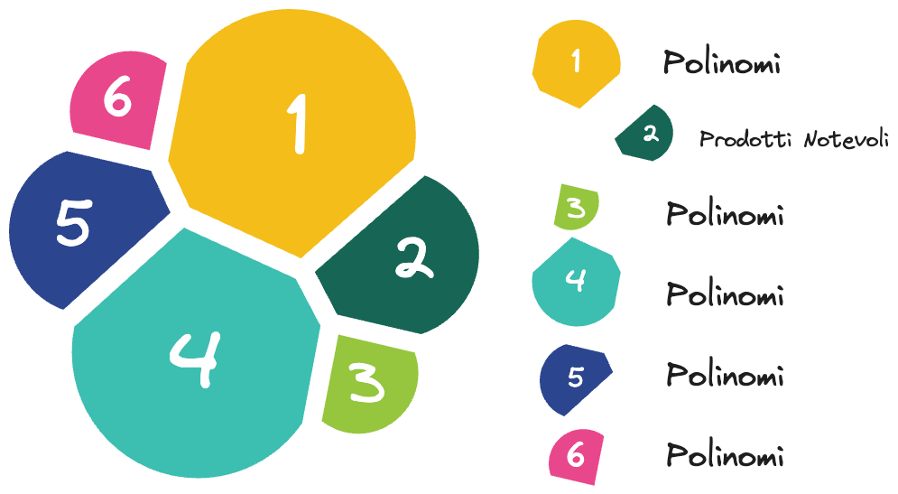
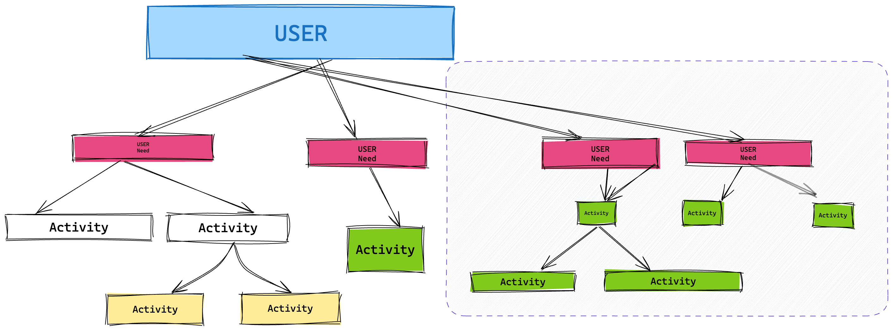
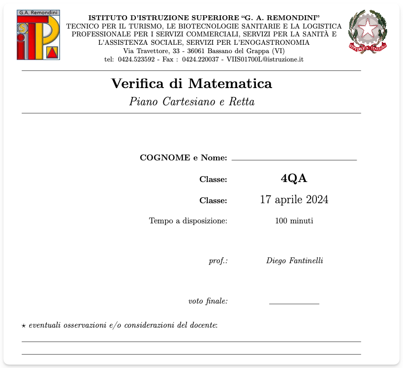

<!-- markdownlint-disable MD033 -->
<!-- markdownlint-disable MD013 -->
<head>
  <title>Lezione simulata</title>
  <link rel="stylesheet" href="style.css">
  <!-- <link rel="stylesheet" href="carte.css"> -->
  <!-- <link rel="stylesheet" href="circular-cards.css"> -->
  <meta name="viewport" content="width=device-width, initial-scale=1">
  <link rel="preconnect" href="https://fonts.googleapis.com">
  <link rel="preconnect" href="https://fonts.gstatic.com" crossorigin>
  <link href="https://fonts.googleapis.com/css2?family=JetBrains+Mono:ital,wght@0,100..800;1,100..800&family=Josefin+Slab:ital,wght@0,100..700;1,100..700&display=swap" rel="stylesheet">
</head>

<section data-transition="convex"data-background-image="book_bkg.jpg" data-background-opacity="0.5" data-transition="convex">
  <h2 style="color:#392613">PROGETTAZIONE ATTIVITÀ DIDATTICA</h2>
  <!-- <h2 style="color:#1d91de">ESEMPIO</h2> -->
  
    <!-- <h3 style="color:#8A4117" class="r-fit-text">Relazioni e funzioni</h3> -->
   
  <h4 style="color##342A2A">Diego Fantinelli - matematica A026</h4>
  <h4>Concorso Straordinario Ter - DM 25.05.2021 n. 73</h4>
  <!-- 
<em><a style="color:#1d91de" href="https://2024-mathofthings.netlify.app/">The Math of Things</a> | <a style="color:#1d91de" href="https://2024-mathofthings.netlify.app/slides/capitolo5/">esempio attività didattica</a></em>
 -->
</section>

<section data-transition="convex"data-background-image="book_bkg.jpg" data-background-opacity="0.5">
  <h2 style="color:#392613; text-align:left;"><i class='fas fa-feather'></i>
    La traccia:</h2>
  <h5 class="r-fit-text" style="color:#392613; text-align: justify;">Sunt id in veniam aliqua amet veniam aliquip ut dolore nisi irure irure duis mollit. Ex sunt irure dolor amet culpa elit proident duis id. Nostrud dolore ipsum amet. Aliqua et ut anim amet enim eu laboris ipsum voluptate Lorem aliqua duis ullamco dolore aliqua aliquip commodo irure cupidatat culpa elit proident duis id.  Aliqua et ut anim amet enim eu laboris ipsum voluptate Lorem aliqua duis ullamco dolore aliqua.</h5>
  
    <!-- <h3 style="color:#8A4117" class="r-fit-text">Relazioni e funzioni</h3> -->
</section>
<!---->
<!-- <section data-background-image="book_bkg.jpg" data-background-opacity="0.5" data-transition="convex"> -->
<!--   <h3 class="r-fit-text" style="color:#3B2F2F"> ATTIVITÀ  DIDATTICA</h3> -->
<!-- </section> -->
<!-- <section data-background-image="book_bkg.jpg" data-background-opacity="0.5" data-transition="convex"> -->
<!--   <!-- <h1 style="color:#8A4117">Milestones</h1> -->
<!--   <h3 class="r-fit-text" style="color:#3B2F2F"> ATTIVITÀ DIDATTICA</h3> -->
<!--   <ul style="font-size:80%"> -->
<!--     <li class="fragment fade-in-then-semi-out" width="30.0%"><b>CONTESTO:&nbsp &nbsp</b>contesto curricolare di riferimento</li> -->
<!--     <li  class="fragment fade-in-then-semi-out" width="30.0%"><b>FRAGILITÀ:&nbsp</b>tipologia e frequenza</li> -->
<!--     <li  class="fragment fade-in-then-semi-out" width="30.0%"><b>COMPETENZE:&nbsp</b> -->
<!--       <ul> -->
<!--         <li>competenze di cittadinanza</li> -->
<!--         <li>linee guida e indicazioni nazionali</li> -->
<!--       </ul> -->
<!--     <li  class="fragment fade-in-then-semi-out" width="30.0%"><b>VERIFICA COMPETENZE:&nbsp</b> valutazione e autovalutazione delle competenze</li> -->
<!--     <li  class="fragment fade-in-then-semi-out" width="30.0%"><b>EFFICACIA DIDATTICA:&nbsp</b> strumenti, metodologie e tecnologie didattiche (TIC)</li> -->
<!--   </ul> -->
<!-- </section> -->
<!---->
<!-- <section data-background-image="book_bkg.jpg" data-background-opacity="0.5" data-transition="convex"> -->
<!--   <h3 class="r-fit-text" style="color:#3B2F2F"> ATTIVITÀ  DIDATTICA</h3> -->
<!-- </section> -->
<section data-background-image="book_bkg.jpg" data-background-opacity="0.5" data-transition="convex">
  <!-- <h1 style="color:#8A4117">Milestones</h1> -->
  <h3 class="r-fit-text" style="color:#3B2F2F"> ATTIVITÀ DIDATTICA</h3>

  <table style="font-size:85%" width="95%">
    <!-- <tr>
<td style="color:#8A4117" width="40.0%"><b>competenze</b></td>
<td width="60.0%"><b>descrizione</b></td>
</tr> -->
    <tr>
      <td width="30.0%"><b>
CONTESTO</b></td>
      <td width="70.0%">contesto curricolare di riferimento</td>
    </tr>
    <tr>
      <td width="30.0%"><b>FRAGILITÀ</b></td>
      <td width="70.0%">tipologia e frequenza delle disabilità</td>
    </tr>
    <tr>
      <td width="30.0%"><b>COMPETENZE</b></em></td>
      <td width="70.0%">
        <ul>
          <li>competenze di cittadinanza</li>
          <li>linee guida e indicazioni nazionali</li>
        </ul>
      </td>
    </tr>
    <tr>
      <td width="30.0%"><b>VERIFICA COMPETENZE</b></td>
      <td width="70.0%">valutazione e autovalutazione delle competenze</td>
    </tr>
    <tr>
      <td width="30.0%"><b>EFFICACIA DIDATTICA</b></td>
      <td width="70.0%">strumenti, metodologie e tecnologie didattiche (TIC)</td>
    </tr>
  </table>
</section>

<!-- <section data-background-image="book_bkg.jpg" data-background-opacity="0.5" data-transition="convex"> -->
<!--   <h2 class="r-fit-text" style="color:#3B2F2F"><i class='fas fa-chalkboard-teacher'></i> CONTESTO DIDATTICO</h2> -->
<!--   <iframe -->
<!--     id="inlineFrameExample" -->
<!--     title="Inline Frame Example" -->
<!--     width="350" -->
<!--     height="300" -->
<!--     src="../2024-ter_lesson/Divisione e Ruffini-Flipped Classroom-contest_prize.pdf"> -->
<!--   </iframe> -->
<!-- </section> -->

---

<section data-auto-animate data-background-image="class03.jpg" data-background-opacity="0.3" data-transition="convex">
  
</section>
<section data-auto-animate data-background-image="class03.jpg" data-background-opacity="0.3" data-transition="convex">
  
  <h2 class="r-fit-text" style="color:#3B2F2F">CONTESTO   DIDATTICO</h2>
  <!-- <h2 class="r-fit-text" style="color:#3B2F2F">DIDATTICO</h2> -->
</section>

<section data-auto-animate data-background-image="class03.jpg" data-background-opacity="0.2" data-transition="convex">
  <h2 class="r-fit-text" style="color:#3B2F2F"> CONTESTO DIDATTICO</h2>
  <h3 style="color:#3B2F2F"> la scuola</h3>
  <table class="fragment" style="font-size:90%; color:#342A2A" width="100%" data-transition="convex">
    <tr>
      <td><b>scuola indirizzo</b></td>
      <td>Istituto Tecnico Industriale Meccatronica</td>
    </tr>
    <tr>
      <td><b>contesto territoriale</b></td>
      <td style="font-size:75%">L'itituto è inserito in un territorio
        fortemente orientato all'agricoltura e alla piccola
        industria/artigianato<b></td>
    </tr>
    <tr>
      <td><b>classe</b></td>
      <td style="font-size:80%"><i>es. seconda - fine primo quadrimestre</i></td>
    </tr>
  </table>
</section>
<section data-auto-animate data-background-image="class03.jpg" data-background-opacity="0.2" data-transition="convex">
  <h2 class="r-fit-text" style="color:#3B2F2F"> CONTESTO DIDATTICO</h2>
  <h3 style="color:#3B2F2F"> la classe</h3>
  <table class="fragment" style="font-size:90%; color:#342A2A" width="100%" data-transition="convex">
    <tr>
      <td><b>classe</b></td>
      <td style="font-size:80%"><i>es. seconda - fine primo quadrimestre</i></td>
    </tr>
    <tr>
      <td><b>composizione</b></td>
      <td style="font-size:80%"><i>n. studenti: $\%$ maschi e $\%$ femmine</i></td>
    </tr>
    <tr>
      <td><b>fragilità</b></td>
      <td style="font-size:80%"><i>$\%$ e tipologia</i></td>
    </tr>
  </table>
</section>

---

<section data-auto-animate data-background-image="fragile.jpg" data-background-opacity="0.4" data-transition="convex">
  
</section>
<section data-auto-animate data-background-image="fragile.jpg" data-background-opacity="0.4" data-transition="convex">
  
  <h2 class="r-fit-text" style="color:#B91C1C">FRAGILITÀ</h2>
  <!-- <h2 class="r-fit-text" style="color:#3B2F2F">DIDATTICO</h2> -->
</section>

<section data-background-image="fragile.jpg" data-background-opacity="0.4" data-transition="convex">
  <!-- <h2 style="color:#3B2F2F">FRAGILITÀ</h2> -->
  <h3 style="color:#b82460;">La Classe come COMUNITÀ</h3>
  <table class="fragment" style="color:#342A2A; font-size:100%" width="100%">
    <tr>
      <td><b>tipologia documentazione</b></td>
      <td style="font-size:90%"><i></b><em>analisi delle certificazioni:  BES, L.104/1992, sostegno, GLO, DSA L.170/2010, D.M. 27/12/2012 e C.M. 08/2013</em><i></td>
    </tr>
    <tr>
      <td><b>collaborazione</b></td>
      <td style="font-size:90%"><i><em>percorso di supporto con studente, CdC, GLO, famiglia ed eventuale sostegno</em> <i></td>
    </tr>
    <tr>
      <td><b>strumenti di lavoro</b></td>
      <td style="font-size:90%"><i>strumenti compensativi e dispensativi: PEI e PDP<i></td>
    </tr>
  </table>
</section>

<section data-auto-animate data-background-image="fragile.jpg" data-background-opacity="0.4" data-transition="convex">
  <h2 class="r-fit-text">OLTRE IL P.d.P.</h2>
  <h3 style="color:#EA580C; text-align:left;"><i class="fas fa-stethoscope"></i> Diagnosi clinica: a memoria!</h3>
  <ul style="color:#392613; text-align:left;">
    <li>Nunc ac scelerisque sem, viverra condimentum turpis. Nulla lacinia pellentesque purus, a egestas nisi consectetur in.</li>
    <li>Etiam ut efficitur purus. Phasellus tellus elit, convallis id leo ac, ornare scelerisque tellus.</li>
  </ul>
</section>

<section data-auto-animate data-background-image="fragile.jpg" data-background-opacity="0.4" data-transition="convex">
  <h2 class="r-fit-text">OLTRE IL P.d.P.</h2>
  <h3 style="color:#EA580C; text-align:left;"><i class="fas fa-hand-holding-heart"></i> EMPATIA</h3>
  <ul style="color:#392613; text-align:left;">
    <li>Nunc ac scelerisque sem, viverra condimentum turpis. Nulla lacinia pellentesque purus, a egestas nisi consectetur in.</li>
    <li>Etiam ut efficitur purus. Phasellus tellus elit, convallis id leo ac, ornare scelerisque tellus.</li>
  </ul>
</section>

<section data-auto-animate data-background-image="fragile.jpg" data-background-opacity="0.4" data-transition="convex">
  <h2 class="r-fit-text">OLTRE IL P.d.P.</h2>
  <h3 style="color:#EA580C; text-align:left;"><i class='fas fa-users'></i> EXTRA-TUTORING</h3>
  <ul style="color:#392613; text-align:left;">
    <li>Nunc ac scelerisque sem, viverra condimentum turpis. Nulla lacinia pellentesque purus, a egestas nisi consectetur in.</li>
    <li>Etiam ut efficitur purus. Phasellus tellus elit, convallis id leo ac, ornare scelerisque tellus.</li>
  </ul>
</section>

---

<section data-auto-animate data-background-image="book_bkg.jpg" data-background-opacity="0.5" data-transition="convex">
  
</section>
<section data-auto-animate data-background-image="book_bkg.jpg" data-background-opacity="0.5" data-transition="convex">
  
  <h1 class="r-fit-text" style="color:#3B2F2F">COMPETENZE</h1>
</section>

<section data-background-image="book_bkg.jpg" data-background-opacity="0.5" data-transition="convex">
  <h3 class="r-fit-text">COMPETENZE DI CITTADINANZA</h3>
  <!-- <h4 style="color:#3B2F2F; font-size:70%;"> D.M. n. 139/ del 22 agosto 2007 </h4> -->
  <!-- 
 Racc. Parlamento Europeo e Consiglio del 18/12/2006 - DM 139 22/08/07 
 -->
  <table class="fragment" width="100%">
    <tr>
      <td style="font-size:60%" width="40.0%"><b>competenze</b></td>
      <td style="font-size:60%" width="60.0%"><b>descrizione</b></td>
    </tr>
    <tr>
      <td style="font-size:55%" width="40.0%"><em>imparare ad imparare</em></td>
      <td style="font-size:50%" width="60.0%">organizzare il proprio apprendimento</td>
    </tr>
    <tr>
      <td style="font-size:55%" width="40.0%"><em>saper progettare</em></td>
      <td style="font-size:50%" width="60.0%">elaborare e realizzare progetti</td>  
    </tr>
    <tr>
      <td style="font-size:55%" width="40.0%"><em>saper comunicare</em></td>
      <td style="font-size:50%" width="60.0%">presentare in modo efficace</td>
    </tr>
    <tr>
      <td style="font-size:55%" width="40.0%"><em>collaborare e partecipare</em></td>
      <td style="font-size:50%" width="60.0%">a. saper interagire in un gruppo b. l'importanza della sinergia</td>
    </tr>
    <tr>
      <td style="font-size:55%" width="40.0%"><em>problem solving</em></td>
      <td style="font-size:50%" width="60.0%">a. sapersi documentare b. formulare ipotesi c. analizzare i dati d. proporre soluzioni</td>
    </tr>
    <tr>
      <td style="font-size:55%" width="40.0%"><em>imparare a collegare</em></td>
      <td style="font-size:50%" width="60.0%">a. mappe concettuali  b. formulare percorsi</td>
    </tr>
    <tr>
      <td style="font-size:55%" width="40.0%"><em>verificare l'informazione</em></td>
      <td style="font-size:50%" width="60.0%">formare e coltivare uno spirito critico</td>
    </tr>
  </table>
</section>

<section data-background-image="book_bkg.jpg" data-background-opacity="0.5" data-transition="convex">
  <!-- <h3 class="r-fit-text">COMPETENZE DI CITTADINANZA</h3> -->
  <h4 class="r-fit-text">COMPETENZE SPECIFICHE DISCIPLINARI</h4>
  <!-- <h5 style="color:#3B2F2F; font-size: 70%;"> Racc. Parlamento Europeo e Consiglio del 18/12/2006 - DM 139 22/08/07 </h5> -->
  <!-- <h4 style="color:#3B2F2F"> specifiche disciplinari </h4> -->
  <!-- <h4 style="color:#3B2F2F"> D.M. n. 139 del 22 agosto 2007 </h2> -->
  <table style="font-size:80%; color:#392613" width="95%">
    <tr>
      <td width="40.0%"><b>competenze</b></td>
      <td width="60.0%"><b>descrizione</b></td>
    </tr>
    <tr>
      <td width="40.0%"><em>1. imparare ad imparare</em></td>
      <td width="60.0%">organizzare il proprio apprendimento</td>
    </tr>
    <tr>
      <td width="40.0%"><em>2. saper progettare</em></td>
      <td width="60.0%">elaborare e realizzare progetti</td>  
    </tr>
    <tr>
      <td width="40.0%"><em>4. collaborare e partecipare</em></td>
      <td width="60.0%">a. saper interagire in un gruppo b. l'importanza della sinergia</td>
    </tr>
    <tr>
      <td width="40.0%"><em>6. problem solving</em></td>
      <td width="60.0%">a. sapersi documentare b. formulare ipotesi c. analizzare i dati d. proporre soluzioni</td>
    </tr>
  </table>
</section>

<section data-background-image="book_bkg.jpg" data-background-opacity="0.5" data-transition="convex">
  <h2 style="color:#8A4117" class="r-fit-text">LINEE GUIDA e INDICAZIONI NAZIONALI 2010</h2>
  <h5><b>Competenze di base - Istituti Tecnici</b></h5><em>
    <h5 style="color:#8A4117">secondo biennio e quinto anno</h5>
    <ul style="font-size:70%">
      <li>Utilizzare il linguaggio e i metodi propri della matematica per organizzare e valutare adeguatamente informazioni qualitative e quantitative</li>
      <li>Utilizzare le strategie del pensiero razionale negli aspetti dialettici e algoritmici per affrontare situazioni problematiche, elaborando opportune soluzioni</li>
      <li>Utilizzare le reti e gli strumenti informatici nelle attività di studio, ricerca e approfondimento disciplinare</li>
      <li>Correlare la conoscenza storica generale agli sviluppi delle scienze, delle tecnologie e delle tecniche negli specifici campi professionali di riferimento</li>
    </ul></em>
</section>

---

<section data-background-image="optical.jpg" data-background-opacity="0.4" data-transition="convex">
  <h1 style="color:#3B2F2F">UNITÀ DIDATTICA</h1>
  <!-- <h1 style="color:#3B2F2F">di</h1> -->
  <h2 class="fragment fade-left r-fit-text" style="color:#3B2F2F">Le equazioni esponenziali</h2>
</section>

<section data-background-image="optical.jpg" data-background-opacity="0.4" data-transition="convex">
  <!-- <h2 class="r-fit-text" style="color:#8A4117">U.d.A. di riferimento</h2> -->
  
    <!-- 
sistema di gestione delle informazioni basato sull'efficacia di <em>tags</em> e <em>backlinks</em> per i collegamenti tra le note; utilizza la semplicità del Markdown ma, tramite infiniti plugin, supporta Html, Css, $\LaTeX$ simulando una gestione della conoscenza sul modello delle reti neuronali
 -->
</section>

---

<section data-auto-animate data-background-image="puzzle.jpg" data-background-opacity="0.4" data-transition="convex">
  
</section>
<section data-auto-animate data-background-image="puzzle.jpg" data-background-opacity="0.3" data-transition="convex">
  
  <h1 style="color:#3B2F2F" class="r-fit-text">VALUTAZIONE</h1>
</section>
<section data-background-image="puzzle.jpg" data-background-opacity="0.3" data-transition="convex">
  <!-- <h1 style="color:#3B2F2F" class="r-fit-text">La VALUTAZIONE</h1> -->
  <h2 class="r-fit-text" style="color:#3B2F2F" >Tipologie di VERIFICA</h2>
  <table class="fragment" style="font-size:70%; width="95%">
    <tr>
      <td width="20.0%"><b>competenze</b></td>
      <td width="60.0%"><b>descrizione</b></td>
      <td width="20.0%"><b>quando</b></td>
      <td width="10.0%"><b>esempio</b></td>
    </tr>
    <tr>
      <td width="30.0%">PREDITTIVA</td>
      <td width="50.0%">Test anonimo e di autovalutazione </td>
      <td width="20.0%">all'inizio dell'UdA</td>
      <td width="20.0%" style="text-align: center;"><a href="./20220224_TEST-1I-Relazioni e funzioni.pdf" target="_blank"><i style="color:#eb432aff;" class="fas fa-file-pdf fa-2x"></i></a></td>
    </tr>
    <tr>
      <td width="30.0%">FORMATIVA</td>
      <td width="50.0%">Peer-Tutoring | Flipped Classroom o Jigsaw</td>
      <td width="20.0%">in itinere </td>
      <td width="20.0%" style="text-align: center;"><a href="./Divisione e Ruffini-Flipped Classroom-contest_prize.pdf" target="_blank"><i style="color:#eb432aff;" class="fas fa-file-pdf fa-2x"></i></a></td>
    </tr>
    <tr>
      <td width="30.0%">SOMMATIVA</td>
      <td width="50.0%">verifica classica: <em>Test + Esercizi</em> </td>
      <td width="20.0%">alla fine dell'UdA</td>
      <td width="20.0%" style="text-align: center;"><a href="./202122-ESEMPIO_VERIFICA_classica-soluzioni.pdf" target="_blank"><i style="color:#eb432aff;" class="fas fa-file-pdf fa-2x"></i></a></td>
    </tr>
    <tr>
      <td width="30.0%">interrogazioni</td>
      <td width="50.0%">recupero o miglioramento</td>
      <td width="20.0%">programmata</td>
      <td width="20.0%" style="text-align: center;"><a href="./20220224_TEST-1I-Relazioni e funzioni.pdf" target="_blank"><i style="color:#eb432aff;" class="fas fa-file-pdf fa-2x"></i></td>
      </a></tr>
  </table>
</section>

---

<section data-auto-animate data-background-image="book_bkg.jpg" data-background-opacity="0.5" data-transition="convex">
  
</section>
<section data-auto-animate data-background-image="book_bkg.jpg" data-background-opacity="0.5" data-transition="convex">
  
  <h1 style="color:#8A4117" class="r-fit-text">STRUMENTI   DIDATTICI</h1>
</section>
<section data-auto-animate data-background-image="book_bkg.jpg" data-background-opacity="0.5" data-transition="convex">
  <h2 style="color:#3B2F2F">TIC avanzate</h2>

  <table class="fragment" style="font-size:55%" width="95%">
    <tr>
      <td width="20.0%"><em><b><a style="color:#1d91de" href="https://obsidian.md/">Obsidian.md</a></b></em></td>
      <td width="80.0%">sistema di gestione delle informazioni basato sull'efficacia di <em>tags</em> e <em>backlinks</em> per i collegamenti tra le note; utilizza la semplicità del Markdown ma, tramite infiniti plugin, supporta Html, Css, $\LaTeX$ simulando una gestione della conoscenza sul modello delle reti neuronali - <em>Second Brain</em></td>
    </tr>
    <tr>
      <td width="20.0%"><em><b><a style="color:#1d91de" href="https://revealjs.com/">NeoVim</a></b></em>
      </td>
      <td width="80.0%">Strumento per la preparazione di presentazioni professionali efficiente e flessibile che supporta Html, Css, Markdown e $\LaTeX$</td>
    </tr>
    <tr>
      <td width="20.0%"><em><b><a style="color:#1d91de" href="https://revealjs.com/">Reveal.js</a></b></em></td>
      <td width="80.0%">Strumento per la preparazione di presentazioni professionali efficiente e flessibile che supporta Html, Css, Markdown e $\LaTeX$</td>
    </tr>
    <tr>
      <td width="20.0%"><em><b>$\LaTeX$</b></em></td>
      <td width="80.0%">per conferire un carattere accademico a tutta la documentazione didattica</td>
    </tr>
    <tr>
      <td width="20.0%"><em><b><a style="color:#1d91de" href="https://2024-mathofthings.netlify.app/">The Math of Things</a></b></em></td>
      <td width="80.0%">un sito web statico sviluppato con <a style="color:#1d91de" href="https://obsidian.md/">Hugo.io</a> come "contenitore didattico" - un ausilio semplice ed efficace alla progettazione didattica; supporta: Markdown, Html, Css, $\LaTeX$ e Reveal.js</td>
    </tr>
  </table>
</section>

<!-- iframe -->
<section data-background-iframe="https://2024-mathofthings.netlify.app/"
  data-background-interactive>
  <!-- <h2>Iframe</h2> -->
</section>

---

<section data-background-image="pile.jpg" data-background-opacity="0.5" data-transition="convex">
  <h1 class="r-fit-text" data-auto-animate style="color:#4E3319">ATTIVITÀ DIDATTICA</h1>
</section>
<section data-background-image="pile.jpg" data-background-opacity="0.3" data-transition="convex">
  <!-- <h2 style="color:#22D3EE">programma</h2> -->
  <!-- <h3 style="color:#3B2F2F">ATTIVITÀ DIDATTICA </h3> -->

  <table class="r-fit-text" style="font-size:85%" width="90%">
    <tr>
      <td style="color:#8A4117" width="20.0%"><em>Fase 1</em></td>
      <td width="50.0%">Questioning</td>
      <td width="10.0%">$5^{\prime}$</td>
    </tr>
    <tr>
      <td style="color:#8A4117" width="20.0%"><em>Fase 2</em></td>
      <td width="50.0%">Framing - <em>mindmapping</em></td>
      <td width="10.0%">$5^{\prime}$</td>
    </tr>
    <tr>
      <td style="color:#8A4117" width="20.0%"><em>Fase 3</em></td>
      <td width="50.0%">Active</td>
      <td width="10.0%">$15^{\prime}$</td>
    </tr>
    <tr>
      <td style="color:#8A4117" width="20.0%"><em>Fase 4</em></td>
      <td width="50.0%">Lab & Cooperative-learning</td>
      <td width="10.0%">$20^{\prime}$</td>
    </tr>
    <tr>
      <td style="color:#8A4117" width="20.0%"><em>Fase 5</em></td>
      <td width="50.0%">Recap</td>
      <td width="10.0%">$10^{\prime}$</td>
    </tr>
    <tr>
      <td style="color:#eb432aff" width="20.0%"><em>Fase 6</em></td>
      <td style="color:#eb432aff" width="50.0%"><em>homework</em></td>
      <td style="color:#eb432aff" width="10.0%"><em>post</em></td>
    </tr>
  </table>
</section>

---

<section data-background-image="qmark.jpg" data-background-opacity="0.5" data-transition="convex">
  <!--  -->
  <h2 style="color:#4E3319">Fase 1</h2>
  <h1 class="r-fit-text" style="color:#4E3319">QUESTIONING</h1>
  <h2 ${\small{5'}}$ </h2>
</section>
<section data-background-image="qmark.jpg" data-background-opacity="0.3" data-transition="convex">
  <!-- <h3 class="r-fit-text" style="color:#8A4117">QUESTIONING</h3> -->
  <!-- <h3 style="color:#3B2F2F" class="fragment">QUESTIONING</h3> -->
  <ul>
    <li style="color:#b82460"><em>stimoli di diversa natura con lo scopo di catturare l'attenzione:</em></li>
    <ul style="font-size: 80%"> 
      <li>una frase, un aforisma, un post, una foto, un video, un articolo, una <em>"provocazione"</em></li>
      <li> tutto il materiale è preparato in anticipo e caricato su: <a style="color:#b82460" href="https://2024-mathofthings.netlify.app/"><em>The Math of Things</em></a></li>
    </ul>
  </ul>
</section>

<section data-background-image="qmark.jpg" data-background-opacity="0.3" data-transition="convex">
  
<em>In fisica e in matematica è impressionante la sproporzione tra lo sforzo per capire una cosa nuova per la prima volta e la semplicità e naturalezza del risultato una volta che i vari passaggi sono stati compiuti.
     Nel prodotto finito, nelle scienze come in poesia, non c'è traccia della fatica del processo creativo e dei dubbi e delle esitazioni che lo accompagnano.

  &mdash; Giorgio Parisi  ("In un volo di storni" - ed. Rizzoli - 2021)
  </em>
</section>

---

<section data-background-image="optical.jpg" data-background-opacity="0.3" data-transition="convex">
  <!--  -->
  <h2 style="color:#4E3319">Fase 2</h2>
  <h1 class="r-fit-text" style="color:#4E3319">FRAMING</h1>
  <h2 ${\small{10'}}$ </h2>
</section>
<section data-background-image="optical.jpg" data-background-opacity="0.3" data-transition="convex">
  <!-- <h2 style="color:#3B2F2F" class="fragment"> FRAMING </h2> -->
  <ul>
    <li style="color:#b82460; font-size: 80%;"><em>un filo conduttore con forte impatto visivo, efficace e sintetico, che permetta di evidenziare:</em></li> 
    <ul class="fragment" style="font-size: 82%;">
      <li><b><em>prerequisiti</b>: da dove veniamo</em></li>
      <li><b><em>obiettivi</b>: dove dobbiamo andare</em></li>
      <li><b><em>strumenti</b>: con quali mezzi affrontiamo il viaggio</em></li>
    </ul>
  </ul>
</section>

<section data-background-image="optical.jpg" data-background-opacity="0.3" data-transition="convex">
  <!--  -->
  <h2 style="color:#8A4117">MINDMAPPING</h2>
  
</section>

---

<section data-background-video="teaching.mp4" data-background-opacity="0.3" data-transition="convex">
  <!--  -->
  <h2 style="color:#4E3319">Fase 3</h2>
  <h1 class="r-fit-text" style="color:#4E3319">ACTIVE</h1>
  <h2 ${\small{20'}}$ </h2>  <!-- <h3 ${\small{15'}}$ minuti</h3> -->
</section>
<section data-background-image="teaching.mp4" data-background-opacity="0.3" data-transition="convex">
  <!-- <h2 style="color:#3B2F2F" class="fragment">ACTIVE   - trasmissiva -</h2> -->
  <!-- <ul class="fragment" data-transition="concave">
<li><h4>Contenuti - Lezione frontale</h4></li>  -->
  <ul class="fragment" style="font-size: 80%;" >
    <li><b>contenuti: </b>della lezione in formato <a style="color:#1d91de" href="https://2023-mathofthings.netlify.app/slides/capitolo5/" target="_blank"><em>slides</em></a></li>
    <li><b>consultazione: </b>libro di testo in formato digitale</li>
    <li><b>consigli: </b>per la revisione in autonomia degli appunti</li>
    <li><b>strumenti informatici: </b><em>Obsidian, VSCode, Reveal.js, etc.</em></li>
  </ul>
  <!-- </ul> -->
</section>
<section data-background-image="calm_bkg.jpg" data-background-opacity="0.4" data-transition="convex">

<h2 style="color:#8A4117">Contenuti specifici &nbsp; </h2>
<h3 style="color:#3B2F2F" class="fragment">Derivate - introduzione</h2>
  <ul class="fragment" style="font-size: 80%;" >
    <li><b>contenuti: </b>della lezione in formato <a style="color:#1d91de" href="https://2023-mathofthings.netlify.app/slides/capitolo5/" target="_blank"><em>slides</em></a></li>
    <li><b>strumenti informatici: </b><em>Obsidian, NeoVim, Reveal.js, etc.</em></li>
  </ul>

  
</section>

<section data-background-image="calm_bkg.jpg" data-background-opacity="0.4" data-transition="convex">

<h2 style="color:#8A4117">Contenuti specifici &nbsp; </h2>
<h3 style="color:#3B2F2F" class="fragment">Derivate - introduzione</h2>
  <ul class="fragment" style="font-size: 80%;" >
    <li><b>contenuti: </b>della lezione in formato <a style="color:#1d91de" href="https://2023-mathofthings.netlify.app/slides/capitolo5/" target="_blank"><em>slides</em></a></li>
    <li><b>problema della tangente: </b><em>Una secante che ce l'ha fatta!</em></li>
  </ul>

  
</section>

<section data-background-image="pingpong_bkg.jpg" data-background-opacity="0.2">
  <h1 class="r-fit-text">elaborazione delle idee</h1>
  

    

      <h3 class="fragment">Titolo</h3>
      
Testo della slide nella colonna di sinistra.

      <ul class="fragment">
        <li>Lista di punti</li>
        <li>Altro punto</li>
        <li>Altro punto</li>
        <li>Altro punto</li>
      </ul>
    

    

      
    

  

</section>

---

<section data-background-video="study.mp4" data-background-opacity="0.3" data-transition="convex">
  <h1 class="r-fit-text" style="color:#8A4117">MATH   Lab</h1>
  <!-- <h1 style="color:#8A4117">FASE 4 &nbsp; ${\small{20'}}$ </h1> -->
</section>
<section data-background-video="study.mp4" data-background-opacity="0.2" data-transition="convex">
  <h3 style="color:#3B2F2F">Math LAB</h3>
  <ul class="fragment" style="font-size: 80%;">
    <li>correzione esercizi assegnati</li>
    <ul style="color:#8A4117">
      <li>a cura dello studente: per acquisire sicurezza</li>
      <li>a cura dell'insegnante</li>
    </ul>
    <li>Cooperative learning: es. peer-tutoring</li>
    <li>strumenti informatici: <em>es. Geogebra, Desmos, Wolfram Alpha, etc.</em></li>
  </ul>
</section>

<section data-background-image="calm_bkg.jpg" data-background-opacity="0.4" data-transition="convex">

<h2 style="color:#8A4117">derivate elementari &nbsp; </h2>
<h3 style="color:#3B2F2F" class="fragment">Derivate - introduzione</h3>
  <ul class="fragment" style="font-size: 80%;">
    <li><b>contenuti: </b>della lezione in formato <a style="color:#1d91de" href="https://2023-mathofthings.netlify.app/slides/capitolo5/" target="_blank"><em>slides</em></a></li>
    <li><b>strumenti informatici: </b><em>Obsidian, NeoVim, Reveal.js, etc.</em></li>
  </ul>

  
</section>

<section data-background-image="calm_bkg.jpg" data-background-opacity="0.4" data-transition="convex">

<h2 style="color:#8A4117">Derivate: operazioni &nbsp; </h2>
<h3 style="color:#3B2F2F" class="fragment">Derivate - introduzione</h3>
  <ul class="fragment" style="font-size: 80%;" >
    <li><b>contenuti: </b>della lezione in formato <a style="color:#1d91de" href="https://2023-mathofthings.netlify.app/slides/capitolo5/" target="_blank"><em>slides</em></a></li>
    <li><b>strumenti informatici: </b><em>Obsidian, NeoVim, Reveal.js, etc.</em></li>
  </ul>

  
</section>

<section data-background-image="pingpong_bkg.jpg" data-background-opacity="0.4" data-transition="convex">

<h2 style="color:#8A4117">Cooperative Lab </h2>

</section>

---

<section data-background-image="calm_bkg.jpg" data-background-opacity="0.5" data-transition="convex">
  <!--  -->
  <h2 style="color:#4E3319">Fase 5</h2>
  <h1 class="r-fit-text" style="color:#4E3319">RECAP</h1>
  <h2 ${\small{5'}}$ </h2>
</section>
<section data-background-image="calm_bkg.jpg" data-background-opacity="0.4" data-transition="convex">
  <!-- <h1 style="color:#8A4117">FASE 5 &nbsp; ${\small{10'}}$ </h1> -->
  <h3 style="color:#3B2F2F">Recap</h3>
  <ul class="fragment">
    <ul>
      <ul style="font-size: 80%;">
        <li>qual è stato l'obiettivo della lezione?</li>
        <li>cos'è rimasto della trattazione?</li>
        <li>consigli per lo studio individuale</li>
      </ul> 
      <li style="color:#b82460; font-size: 32px"><em>in questa fase è indispensabile il coinvolgimento attivo degli studenti</em></li>
    </ul>
</section>

---

<section data-background-image="book_bkg.jpg" data-background-opacity="0.4" data-transition="convex">
  <h1 class="r-fit-text" style="color:#8A4117">HOMEWORKS </h1>
  <!-- <h1 style="color:#8A4117">FASE 6 &nbsp; <em>post</em></h1> -->
</section>  
<section data-background-image="book_bkg.jpg" data-background-opacity="0.4" data-transition="convex">

<h3 class="r-fit-text" style="color:#8A4117">Lavoro in autonomia</h3>
  <!-- <h2 style="color:#3B2F2F" class="fragment">Homeworks</h2> -->
  <ul style="font-size: 80%;">
    <!-- <li><h3 style="color:#8A4117">Lavoro in autonomia</h3></li> -->
    <!-- <ul> -->
    <li>rielaborazione e integrazione<em> guidata</em> degli appunti</li>
    <li>esercizi assegnati </li>
    <li>attività collaborative - <em>cooperative learning</em></li>
  </ul> 
  <li style="color:#b82460"><em>tutti i materiali vengono condivisi su Google Classroom</em></li>
  </ul>
</section>

---

<section data-background-image="book_bkg.jpg" data-background-opacity="0.4" data-transition="convex">
  <h2>bibliografia</h2>
  <ul class="r-fit-text" style="font-size: 80%;">
    <li>RACC. U.E. 2018 e D.M. 139/2007 All. 2 (Competenze chiave)</li>
    <li>D.P.R. $89 / 2010$ (Regolamento licei)</li>
    <li>P.N.S.D. (Piano Nazionale Scuola Digitale)</li>
    <li>L.107/2015 (Buona Scuola)</li>
    <li>D.M. 139/2007 (regolamento sull'obbligo di istruzione)</li>

    <li>DPR 122/2009 (valutazioni)</li>
    <li>DPR 275/99 (autonomia istituzioni scolastiche)</li>
    <li>L.170/2010 (dsa), direttiva minist. 27/12/2012 e n. 8 del 6/03/2013</li>

    <li>YouTube: Andrea Anfosso, Mathsegnale, Alberto Saracco</li>
    <li>Zanichelli, Matematica Blu 2.0, vol. 4</li>
  </ul>
</section>

<!-- <section data-auto-animate data-background-image="book_bkg.jpg" data-background-opacity="0.4" data-transition="convex"> -->
<!-- <h2>bibliografia</h2> -->
<!-- <ul class="r-fit-text" style="font-size: 80%;"> -->
<!-- <li style="color:#8A4117; font-size: 50%">RACC. U.E. 2018 e D.M. 139/2007 All. 2 (Competenze chiave)</li> -->
<!-- <li style="font-size: 80%">D.P.R. $89 / 2010$ (Regolamento licei)</li> -->
<!-- <li style="color:#8A4117">P.N.S.D. (Piano Nazionale Scuola Digitale)</li> -->
<!-- <li style="color:#8A4117">L.107/2015 (Buona Scuola)</li> -->
<!-- <li style="font-size: 80%">D.M. 139/2007 (regolamento sull'obbligo di istruzione)</li> -->
<!---->
<!-- <li style="font-size: 80%">DPR 122/2009 (valutazioni)</li> -->
<!-- <li style="color:#8A4117">DPR 275/99 (autonomia istituzioni scolastiche)</li> -->
<!-- <li style="font-size: 80%">L.170/2010 (dsa), direttiva minist. 27/12/2012 e n. 8 del 6/03/2013</li> -->
<!---->
<!-- <li>YouTube: Andrea Anfosso, Mathsegnale, Alberto Saracco</li> -->
<!-- <li>Zanichelli, Matematica Blu 2.0, vol. 4</li> -->
<!-- </ul> -->
<!-- </section> -->

---

<!-- <section data-auto-animate data-background-video="ntwk_bkg.mp4" data-background-opacity="0.7" data-transition="convex"> -->
<!--  -->
<!--   </section> -->
<section data-auto-animate data-background-video="ntwk_bkg.mp4" data-background-opacity="0.7" data-transition="convex">
  <!-- 
  <!--     style="width:200px;height:200px;color:#3B2F2F;opacity:0.7"> -->
  <h1 style="color:#8A4117" class="r-fit-text">CREARE</h1>
  <h1 style="color:#8A4117" class="r-fit-text">CONNESSIONI</h1>
</section>
<!-- <section data-auto-animate data-background-video="ntwk_bkg.mp4" data-background-opacity="0.7" data-transition="convex"> -->
<!--   <!-- <h2 style="color:#8A4117" class="r-fit-text">CREARE CONNESSIONI</h2> -->
<!--   
"La matematica non ha come finalità quella di imparare formule e/o dimostrazioni a memoria, bensì di imparare a <b><u>collegare concetti</u></b>, per stimolare la formazione di uno <b><u>spirito critico</u></b>"
 -->
<!-- </section> -->

<section data-background-video="ntwk_bkg.mp4" data-background-opacity="0.7" data-transition="convex">
  <q style="font-family: 'Josefin Slab'; font-size:50px; text-align: justify-left;" data-transition="convex">La matematica è una scienza di modelli. Si occupa di modelli astratti più che del mondo concreto, ma i modelli matematici possono spesso illuminare o addirittura spiegare fenomeni reali. La potenza di un modello matematico è nella sua semplicità e generalità. - Carl Boyer</q>
</section>

<section data-background-video="ntwk_bkg.mp4" data-background-opacity="0.7" data-transition="convex">
  <q style="font-family: 'Josefin Slab'; font-size:50px; text-align: justify-left;" data-transition="convex">La matematica non ha come finalità quella di imparare formule e/o dimostrazioni a memoria, bensì di imparare a <b><u>collegare concetti</u></b>, per stimolare la formazione di uno <b><u>spirito critico</u></b></q>
</section>

<section data-background-color="#EFEFEF" data-transition="zoom">
  
</section>
