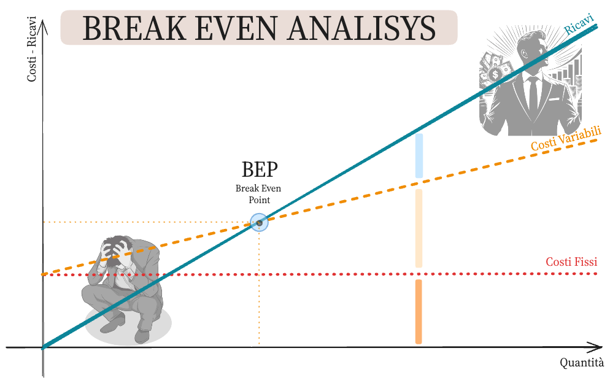

<!-- markdownlint-disable MD033 -->
<!-- markdownlint-disable MD013 -->
<head>
  <title>Lezione simulata</title>
  <link rel="stylesheet" href="style.css">
  <!-- <link rel="stylesheet" href="carte.css"> -->
  <!-- <link rel="stylesheet" href="circular-cards.css"> -->
  <meta name="viewport" content="width=device-width, initial-scale=1">
  <link rel="preconnect" href="https://fonts.googleapis.com">
  <link rel="preconnect" href="https://fonts.gstatic.com" crossorigin>
  <link href="https://fonts.googleapis.com/css2?family=JetBrains+Mono:ital,wght@0,100..800;1,100..800&family=Josefin+Slab:ital,wght@0,100..700;1,100..700&family=Slabo+13px&display=swap" rel="stylesheet">
</head>

<!-- <section data-background-image="bea_bkg.jpg" data-background-opacity="0.7" data-transition="convex"> -->
<!--   
<!--     style="color:#DC2626;color:#B91C1C;opacity:0.9;"> -->
<!-- </section> -->
<section data-background-image="bea_bkg.jpg" data-background-opacity="0.4" data-transition="convex">
  <h2 class="r-fit-text" style="color:#B91C1C">BREAK EVEN ANALYSIS</h2>
  <h3 class="r-fit-text" style="color:#B91C1C">Analisi del Punto di Pareggio</h3>
  <q style="color:#3B2F2F">Never give a sucker an even break.  &mdash; W. C. Fields</q>  
  <q style="color:#3B2F2F"><q>Nowadays, you have to sell, like, half a million or a million records just to break even.  &mdash; Maynard James Keenan</q>
</section>
<section data-background-image="bea_bkg.jpg" data-background-opacity="0.4" data-transition="convex">
  <ul>
<h2 style="text-align:left;color:#B91C1C">Break Even Analysis</h2>
    <li class="fragment"><h4>sintesi da un punto di vista aziendale - micoeconomico</h4>
    <li class="fragment"><h4>analisi del grafico</h4>
    <li class="fragment"><h4>analisi dal punto di vista matematico</h4>
</li>
  </ul>
</section>

<section data-background-image="bea_bkg.jpg" data-background-opacity="0.4" data-transition="convex">
  <h2 style="text-align:left; color:#B91C1C">Introduzione</h2>
  <h4 style="text-align:left;color:#B91C1C">Cos'è la Break Evene Analisys?</h4>
  <ul>
    <li>L'Analisi del Punto di Pareggio - Break Even Analysis, BEA - è una tecnica utilizzata per determinare il livello di vendite necessario per coprire i costi totali, - somma dei costi fissi e di quelli variabili - senza generare né profitti né perdite. </li>
  </ul>
</section>

---

<section data-background-image="bea_bkg.jpg" data-background-opacity="0.4" data-transition="convex">
  <h4 class="r-fit-text" style="text-align:left;color:#B91C1C"> Obiettivo della BEA</h4>

  <ul>
    <li>Identificare il punto in cui le entrate totali e i costi totali si equivalgono.
    </li>
  </ul>
</section>

<section data-background-image="bea_bkg.jpg" data-background-opacity="0.4" data-transition="convex">
  <h4 class="r-fit-text" style="text-align:left;color:#B91C1C">Componenti della BEA</h4>
  <ul style="font-size:85%">
    <li><strong>Costi Fissi $(C_F)$:</strong> Costi che non variano con il livello di produzione (e.g., affitti, stipendi).</li>
    <li><strong>Costi Variabili $(C_V)$:</strong> Costi che variano direttamente con il livello di produzione (e.g., materie prime, manodopera).</li>
    <li><strong>Prezzo di Vendita $(P)$:</strong> Prezzo al quale il prodotto viene venduto.</li>
    <li><strong>Volume di Vendita $(Q)$:</strong> Numero di unità vendute.</li>
  </ul>
</section>
<section data-background-image="bea_bkg.jpg" data-background-opacity="0.4" data-transition="convex">
  <h2 style="text-align:left;color:#B91C1C">Utilità della BEA</h2>
  <ul style="font-size:80%">
    <li><strong>Pianificazione Finanziaria:</strong> Aiuta le aziende a comprendere quanti prodotti devono vendere per coprire i costi.</li>
    <li><strong>Decisioni di Prezzo:</strong> Assiste nel determinare il prezzo di vendita per garantire che i costi siano coperti.</li>
    <li><strong>Valutazione dei Rischi:</strong> Analizza l'impatto delle variazioni nei costi e nei prezzi sulle operazioni aziendali.</li>
    <li><strong>Supporto per la Strategia di Marketing:</strong> Determina i volumi di vendita necessari per raggiungere gli obiettivi di profitto.</li>
  </ul>
</section>

---

<section data-background-image="bea_bkg.jpg" data-background-opacity="0.4" data-transition="convex">
  <h1 style="r-fit-text;color:#B91C1C">Grafico della BEA</h1>
</section>
<section data-background-image="bea_bkg.jpg" data-background-opacity="0.4" data-transition="convex">
  
</section>

<section data-background-image="bea_bkg.jpg" data-background-opacity="0.4" data-transition="convex">
  <h3 style="text-align:left;color:#B91C1C">Descrizione del Grafico</h4>
    <ul style="font-size:80%">
      <li>Il grafico del punto di pareggio mostra l'intersezione tra la retta delle entrate totali e la retta dei costi totali.</li>
    </ul>
    <h4 style="text-align:left;color:#B91C1C">Elementi del Grafico</h4>
    <ul style="font-size:80%">
      <li><strong>Asse delle x:</strong> Volume di Vendita $(Q)$</li>
      <li><strong>Asse delle y:</strong> Valore Monetario $(€)$</li>
      <li><strong>Retta delle Entrate Totali $(R_T)$:</strong> $\quad R_T = P \times Q$</li>
      <li><strong>Retta dei Costi Totali $(C_T)$:</strong> $\quad C_T = C_F + C_V \times Q$</li>
      <li><strong>Punto di Pareggio $(Q^*)$:</strong> Punto di intersezione tra $R_T$ e $C_T$</li>
    </ul>
</section>

---

<section data-background-image="bea_bkg.jpg" data-background-opacity="0.4" data-transition="convex">
  <h1 style="r-fit-text;text-align:left;color:#B91C1C">Punto di vista matematico</h1>
</section>
<section data-background-image="bea_bkg.jpg" data-background-opacity="0.4" data-transition="convex">
  <h3 style="text-align:left">Analisi Matematica della BEA</h3>
  <ul style="font-size:80%">
    <li><strong>Equazioni:</strong></li>
    <ul>
      <li>Entrate Totali (RT): &bnsp; $R_T = P \times Q$</li>
      <li>Costi Totali (CT):&nbsp; $C_T = C_F + C_V \times Q$</li>
    </ul>
    <li><strong>Punto di Pareggio:</strong> &nbsp; $R_T = C_T$
      
$$\begin{equation*}
        \left\{
        \begin{aligned}
        & R_T = P \times Q \\[10pt]
        & C_T = C_F + C_V \times Q
        \end{aligned}
        \right.
        \end{equation*}  \Rightarrow P \times Q^* = C_F + C_V \times Q^*$$

    </li>
      <h3>$$Q^* = \dfrac{C_F}{P - C_V}$$</h3>
</section>
<section data-background-image="bea_bkg.jpg" data-background-opacity="0.4" data-transition="convex">
  <h2 style="text-align:left">Significato matematico</h2>
  
Se da un punto di vista economico il <strong>Punto di Pareggio</strong> rappresenta la quantità <em>ideale</em> $Q^*$ che comporta un valore dei <strong>Ricavi totali</strong> uguale a quello dei <strong>Costi totali</strong>, da un punto di vista matematico si tratta del <strong>punto di intersezione</strong> tra due rette.

  <ul>
    <li><strong>Intersezione delle Rette:</strong> &nbsp; Il punto di pareggio è l'intersezione tra la retta delle entrate totali e quella dei costi totali.</li>
  </ul>
</section>

---

<section data-background-image="bea_bkg.jpg" data-background-opacity="0.4" data-transition="convex">
  <h2 style="text-align:left; color:#B91C1C" class:="r-fit-text"> Conclusioni</h2>
  <ul>
    <li class="fragment">
      La BEA è uno strumento cruciale per la pianificazione aziendale e la gestione dei costi.
    </li>
    <li class="fragment">
Aiuta a prendere decisioni informate su produzione, prezzi e strategie di mercato.
    <li class="fragment">
    Fondamentale per startup e aziende esistenti per valutare la redditività e i rischi.
    </li>
  </ul>
</section>

<section data-background-image="bea_bkg.jpg" data-background-opacity="0.4" data-transition="convex">
  <h1>The End</h1>
</section>

